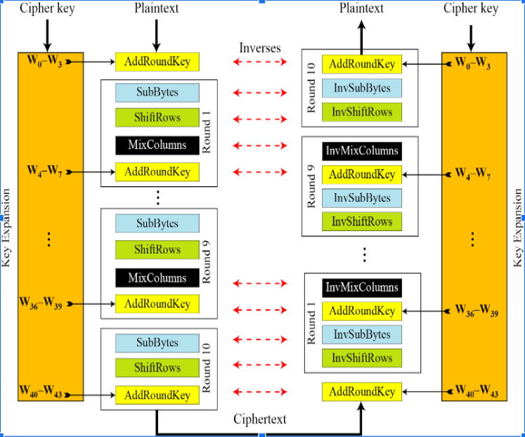

# Giải thích thuật toán
AES làm việc theo dạng ma trận 4 hàng 4 cột
### Sơ đồ thuật toán

### Giải thích các phép toán
- **AddRoundKey**: Là phép XOR với Key Expansion
- **SubByte**: Là phép tham chiếu đến bảng [S-Box](#Bảng-SBox)
- **ShiftRows**: Là phép dịch trái 1 byte, 2 byte và 3 byte lần lượt là hàng thứ 2, thứ 3 và thứ 4
- **MixColumns**: Là phép nhân ma trận với bảng [MixColumns](#Bảng-MixColumns) đã được định nghĩa sẵn với các phép toán trên trường Galois GF( $2^8$ )
### Ví dụ
***Input***:
- Plaintext = a3 c5 08 08 78 a4 ff d3 00 ff 36 36 28 5f 01 02
- Cipherkey = 36 8a c0 f4 ed cf 76 a6 08 a3 b6 78 31 31 27 6e (Lấy ở Bài 2)

***Output***:
- Ciphertext = a6 24 62 48 34 dd a8 b9 1a f1 73 5d 00 0e cf 61

### Trình bày thuật toán

**Khởi tạo AddRoundKey**: Là phép XOR giữa ***Plaintext*** với ***Cipherkey*** sắp xếp theo dạng ma trận như hình dưới

$$
\begin{matrix}
  a3 & 78 & 00 & 28 \\
  c5 & a4 & ff & 5f \\
  08 & ff & 36 & 01 \\
  08 & d3 & 36 & 02 
 \end{matrix}
 \oplus
\begin{matrix}
  36 & ed & 08 & 31 \\
  8a & cf & a3 & 31 \\
  c0 & 76 & b6 & 27 \\
  f4 & a6 & 78 & 6e 
 \end{matrix}
 \rightarrow
  \begin{matrix}
    95 & 95 & 08 & 19 \\
    4f & 6b & 5c & 6e \\
    c8 & 89 & 80 & 26 \\
    fc & 75 & 4e & 6c 
   \end{matrix}
$$

**Vòng 1**:
- ***SubByte***: Thực hiện tham chiếu đến bảng [S-Box](#Bảng-SBox)

$$
\begin{matrix}
    95 & 95 & 08 & 19 \\
    4f & 6b & 5c & 6e \\
    c8 & 89 & 80 & 26 \\
    fc & 75 & 4e & 6c 
   \end{matrix}
   \rightarrow
 \begin{matrix}
    2a & 2a & 30 & d4 \\
    84 & 7f & 4a & 9f \\
    e8 & a7 & cd & f7 \\
    b0 & 9d & 2f & 50 
   \end{matrix}
$$

- ***ShiftRows***: Thực hiện **dịch trái** 1 byte, 2 byte và 3 byte lần lượt hàng thứ 2, thứ 3 và thứ 4

$$
\begin{matrix}
    2a & 2a & 30 & d4 \\
    84 & 7f & 4a & 9f \\
    e8 & a7 & cd & f7 \\
    b0 & 9d & 2f & 50 
   \end{matrix}
   \rightarrow
   \begin{matrix}
    2a & 2a & 30 & d4 \\
    7f & 4a & 9f & 84 \\
    cd & f7 & e8 & a7 \\
    50 & b0 & 9d & 2f 
   \end{matrix}
$$

- ***MixColumns***: Thực hiện nhân ma với bảng [MixColumns](#Bảng-MixColumns) đã được định nghĩa sẵn với các phép toán trên trường Galois GF( $2^8$ )

$$
\begin{matrix}
    2a & 2a & 30 & d4 \\
    7f & 4a & 9f & 84 \\
    cd & f7 & e8 & a7 \\
    50 & b0 & 9d & 2f 
   \end{matrix}
   \times
   \begin{matrix}
    02 & 03 & 01 & 01 \\
    01 & 02 & 03 & 01 \\
    01 & 01 & 02 & 03 \\
    03 & 01 & 01 & 02 
   \end{matrix}
   \rightarrow
   \begin{matrix}
    48 & cd & af & ac \\
    c8 & 0c & ab & 1a \\
    24 & 5e & d8 & 74 \\
    6c & b8 & 06 & 1a 
   \end{matrix}
$$

- ***AddRoundKey***: Thực hiện XOR với các từ từ w[4] đến w[7] của thuật toán Key Expansion đối chiếu ở bài 2 sắp xếp như hình bên dưới

$$
\begin{matrix}
    48 & cd & af & ac \\
    c8 & 0c & ab & 1a \\
    24 & 5e & d8 & 74 \\
    6c & b8 & 06 & 1a 
   \end{matrix}
    \oplus
    \begin{matrix}
    f0 & 1d & 15 & 24 \\
    46 & 89 & 2a & 1b \\
    5f & 29 & 9f & b8 \\
    33 & 95 & ed & 83 
   \end{matrix}
   \rightarrow
   \begin{matrix}
    b8 & d0 & ba & 88 \\
    8e & 85 & 81 & 01 \\
    7b & 77 & 47 & cc \\
    5f & 2d & eb & 99 
   \end{matrix}
$$

### Bảng SBox
