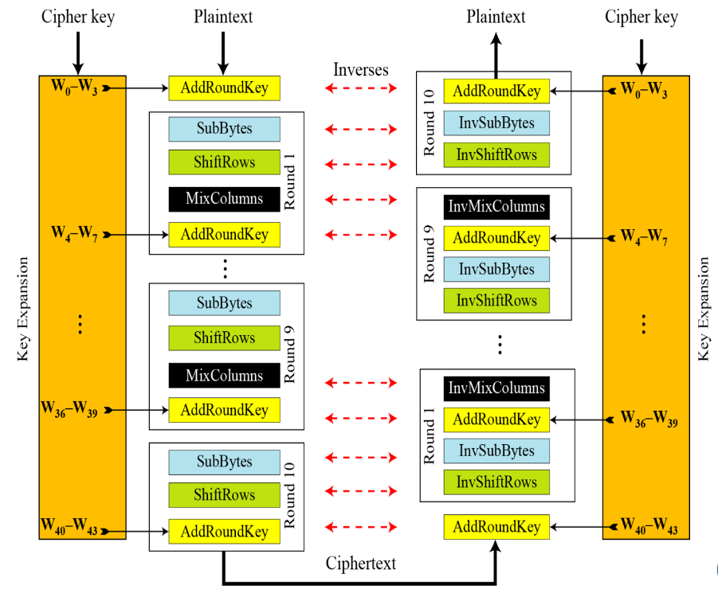

# Giải thích thuật toán
AES làm việc theo dạng ma trận 4 hàng 4 cột
### Sơ đồ thuật toán


### Giải thích các phép toán
- **AddRoundKey**: Là phép XOR với Key Expansion
- **SubByte**: Là phép tham chiếu đến bảng [S-Box](#Bảng-SBox)
- **ShiftRows**: Là phép dịch trái 1 byte, 2 byte và 3 byte lần lượt là hàng thứ 2, thứ 3 và thứ 4
- **MixColumns**: Là phép nhân ma trận với bảng [MixColumns](#Bảng-MixColumns) đã được định nghĩa sẵn với các phép toán trên trường Galois GF( $2^8$ )
### Ví dụ
***Input***:
- Plaintext = a3 c5 08 08 78 a4 ff d3 00 ff 36 36 28 5f 01 02
- Cipherkey = 36 8a c0 f4 ed cf 76 a6 08 a3 b6 78 31 31 27 6e (Lấy ở Bài 2)

***Output***:
- Ciphertext = a6 24 62 48 34 dd a8 b9 1a f1 73 5d 00 0e cf 61

### Trình bày thuật toán

**Khởi tạo AddRoundKey**: Là phép XOR giữa ***Plaintext*** với ***Cipherkey*** sắp xếp theo dạng ma trận như hình dưới

$$
\begin{matrix}
  a3 & 78 & 00 & 28 \\
  c5 & a4 & ff & 5f \\
  08 & ff & 36 & 01 \\
  08 & d3 & 36 & 02 
 \end{matrix}
 \oplus
\begin{matrix}
  36 & ed & 08 & 31 \\
  8a & cf & a3 & 31 \\
  c0 & 76 & b6 & 27 \\
  f4 & a6 & 78 & 6e 
 \end{matrix}
 \rightarrow
  \begin{matrix}
    95 & 95 & 08 & 19 \\
    4f & 6b & 5c & 6e \\
    c8 & 89 & 80 & 26 \\
    fc & 75 & 4e & 6c 
   \end{matrix}
$$

Ta có:
- $(a3)_6$ = $(1010 0011)_2$
- $(36)_6$ = $(0011 0110)_2$
- $(1010 0011)_2$ $\oplus$ $(0011 0110)_2$ = $(1001 0101)_2$ = $(95)_6$

Tương tự với các số còn lại, ta có kết quả như hình trên

**Vòng 1**:
- ***SubByte***: Thực hiện tham chiếu đến bảng [S-Box](#Bảng-SBox)

$$
\begin{matrix}
    95 & 95 & 08 & 19 \\
    4f & 6b & 5c & 6e \\
    c8 & 89 & 80 & 26 \\
    fc & 75 & 4e & 6c 
   \end{matrix}
   \rightarrow
 \begin{matrix}
    2a & 2a & 30 & d4 \\
    84 & 7f & 4a & 9f \\
    e8 & a7 & cd & f7 \\
    b0 & 9d & 2f & 50 
   \end{matrix}
$$

Ta có:
1. ***95*** tham chiếu đến bảng S-Box **hàng 9 cột 5** ta được kết quả là **2a**
2. ***4f*** tham chiếu đến bảng S-Box **hàng 4 cột f** ta được kết quả là **84**

Tương tự ta có các kết quả còn lại


- ***ShiftRows***: Thực hiện **dịch trái** 1 byte, 2 byte và 3 byte lần lượt hàng thứ 2, thứ 3 và thứ 4

$$
\begin{matrix}
    2a & 2a & 30 & d4 \\
    84 & 7f & 4a & 9f \\
    e8 & a7 & cd & f7 \\
    b0 & 9d & 2f & 50 
   \end{matrix}
   \rightarrow
   \begin{matrix}
    2a & 2a & 30 & d4 \\
    7f & 4a & 9f & 84 \\
    cd & f7 & e8 & a7 \\
    50 & b0 & 9d & 2f 
   \end{matrix}
$$

- ***MixColumns***: Thực hiện nhân ma với bảng [MixColumns](#Bảng-MixColumns) đã được định nghĩa sẵn với các phép toán trên trường Galois GF( $2^8$ )

$$
\begin{matrix}
    2a & 2a & 30 & d4 \\
    7f & 4a & 9f & 84 \\
    cd & f7 & e8 & a7 \\
    50 & b0 & 9d & 2f 
   \end{matrix}
   \times
   \begin{matrix}
    02 & 03 & 01 & 01 \\
    01 & 02 & 03 & 01 \\
    01 & 01 & 02 & 03 \\
    03 & 01 & 01 & 02 
   \end{matrix}
   \rightarrow
   \begin{matrix}
    48 & cd & af & ac \\
    c8 & 0c & ab & 1a \\
    24 & 5e & d8 & 74 \\
    6c & b8 & 06 & 1a 
   \end{matrix}
$$

Ta có:

1. Thực hiện nhân ma trận 
    - (2a x 02) $\oplus$ (2a x 01) $\oplus$ (30 x 01) $\oplus$ (d4 x 03)
2. Phân tích phép nhân
    - Cụm (2a x 02):
      - $(2a)_6$ = $(00100110)_2$ = $x^5 + x^2 + x$
      - $(02)_6$ = $(00000010)_2$ = $x$
      - $(x^5 + x^2 + x)x$ = $x^6 + x^3 + x^2$ = $(01001100)_2$
- ***AddRoundKey***: Thực hiện XOR với các từ từ w[4] đến w[7] của thuật toán Key Expansion đối chiếu ở bài 2 sắp xếp như hình bên dưới

$$
\begin{matrix}
    48 & cd & af & ac \\
    c8 & 0c & ab & 1a \\
    24 & 5e & d8 & 74 \\
    6c & b8 & 06 & 1a 
   \end{matrix}
    \oplus
    \begin{matrix}
    f0 & 1d & 15 & 24 \\
    46 & 89 & 2a & 1b \\
    5f & 29 & 9f & b8 \\
    33 & 95 & ed & 83 
   \end{matrix}
   \rightarrow
   \begin{matrix}
    b8 & d0 & ba & 88 \\
    8e & 85 & 81 & 01 \\
    7b & 77 & 47 & cc \\
    5f & 2d & eb & 99 
   \end{matrix}
$$

### Bảng SBox
|   | 0  | 1  | 2  | 3  | 4  | 5  | 6  | 7  | 8  | 9  | a  | b  | c  | d  | e  | f  |
| --- | --- | --- | --- | --- | --- | --- | --- | --- | --- | --- | --- | --- | --- | --- | --- | --- |
| **0** | 63 | 7c | 77 | 7b | f2 | 6b | 6f | c5 | 30 | 01 | 67 | 2b | fe | d7 | ab | 76 |  
| **1** | ca | 82 | c9 | 7d | fa | 59 | 47 | f0 | ad | d4 | a2 | af | 9c | a4 | 72 | c0 |  
| **2** | b7 | fd | 93 | 26 | 36 | 3f | f7 | cc | 34 | a5 | e5 | f1 | 71 | d8 | 31 | 15 |  
| **3** | 04 | c7 | 23 | c3 | 18 | 96 | 05 | 9a | 07 | 12 | 80 | e2 | eb | 27 | b2 | 75 |  
| **4** | 09 | 83 | 2c | 1a | 1b | 6e | 5a | a0 | 52 | 3b | d6 | b3 | 29 | e3 | 2f | 84 |  
| **5** | 53 | d1 | 00 | ed | 20 | fc | b1 | 5b | 6a | cb | be | 39 | 4a | 4c | 58 | cf |  
| **6** | d0 | ef | aa | fb | 43 | 4d | 33 | 85 | 45 | f9 | 02 | 7f | 50 | 3c | 9f | a8 |  
| **7** | 51 | a3 | 40 | 8f | 92 | 9d | 38 | f5 | bc | b6 | da | 21 | 10 | ff | f3 | d2 |  
| **8** | cd | 0c | 13 | ec | 5f | 97 | 44 | 17 | c4 | a7 | 7e | 3d | 64 | 5d | 19 | 73 |  
| **9** | 60 | 81 | 4f | dc | 22 | 2a | 90 | 88 | 46 | ee | b8 | 14 | de | 5e | 0b | db |  
| **a** | e0 | 32 | 3a | 0a | 49 | 06 | 24 | 5c | c2 | d3 | ac | 62 | 91 | 95 | e4 | 79 | 
| **b** | e7 | c8 | 37 | 6d | 8d | d5 | 4e | a9 | 6c | 56 | f4 | ea | 65 | 7a | ae | 08 | 
| **c** | ba | 78 | 25 | 2e | 1c | a6 | b4 | c6 | e8 | dd | 74 | 1f | 4b | bd | 8b | 8a | 
| **d** | 70 | 3e | b5 | 66 | 48 | 03 | f6 | 0e | 61 | 35 | 57 | b9 | 86 | c1 | 1d | 9e | 
| **e** | e1 | f8 | 98 | 11 | 69 | d9 | 8e | 94 | 9b | 1e | 87 | e9 | ce | 55 | 28 | df | 
| **f** | 8c | a1 | 89 | 0d | bf | e6 | 42 | 68 | 41 | 99 | 2d | 0f | b0 | 54 | bb | 16 |

<details><summary>Copy bảng S-Box</summary>
<p>

```
"63","7c","77","7b","f2","6b","6f","c5","30","01","67","2b","fe","d7","ab","76",
"ca","82","c9","7d","fa","59","47","f0","ad","d4","a2","af","9c","a4","72","c0",
"b7","fd","93","26","36","3f","f7","cc","34","a5","e5","f1","71","d8","31","15",
"04","c7","23","c3","18","96","05","9a","07","12","80","e2","eb","27","b2","75",
"09","83","2c","1a","1b","6e","5a","a0","52","3b","d6","b3","29","e3","2f","84",
"53","d1","00","ed","20","fc","b1","5b","6a","cb","be","39","4a","4c","58","cf",
"d0","ef","aa","fb","43","4d","33","85","45","f9","02","7f","50","3c","9f","a8",
"51","a3","40","8f","92","9d","38","f5","bc","b6","da","21","10","ff","f3","d2",
"cd","0c","13","ec","5f","97","44","17","c4","a7","7e","3d","64","5d","19","73",
"60","81","4f","dc","22","2a","90","88","46","ee","b8","14","de","5e","0b","db",
"e0","32","3a","0a","49","06","24","5c","c2","d3","ac","62","91","95","e4","79",
"e7","c8","37","6d","8d","d5","4e","a9","6c","56","f4","ea","65","7a","ae","08",
"ba","78","25","2e","1c","a6","b4","c6","e8","dd","74","1f","4b","bd","8b","8a",
"70","3e","b5","66","48","03","f6","0e","61","35","57","b9","86","c1","1d","9e",
"e1","f8","98","11","69","d9","8e","94","9b","1e","87","e9","ce","55","28","df",
"8c","a1","89","0d","bf","e6","42","68","41","99","2d","0f","b0","54","bb","16",
```

</p>
</details>

### Bảng MixColumn
| 02  | 03 | 01 | 01 |
| --- | --- | --- | --- |
| **01**  | **02** | **03** | **01** |
| **01**  | **01** | **02** | **03** |
| **03**  | **01** | **01** | **02** |

<details><summary>Copy bảng MixColumns</summary>
<p>

```
"02","03","01","01",
"01","02","03","01",
"01","01","02","03",
"03","01","01","02",
```

</p>
</details>
